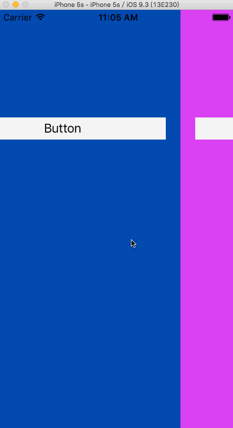

# JCSlideView
JCSlideView是一个简单易用的左右滑动切换页面，使用手势和ViewController实现
每个展示的View都有ViewController控制
做到View与最底部的controller分层，方便复用

##使用

    self.slideView.baseViewController = self;
    self.slideView.dataSource = self;
    //使用NSCache保存显示的ViewController
    self.cacheControllers = [[NSCache alloc] init];
    [self.slideView showViewControllerAtIndex:0];

/#pragma mark JCSlideViewDataSource

- (UIViewController *)JCSlideView:(JCSlideView *)slideView viewControllerAtIndex:(NSInteger)index {
    
    JCPageViewController *viewController = [self.cacheControllers objectForKey:[NSString stringWithFormat:@"%ld", (long)index]];
    
    if (viewController) {
        return viewController;
    }
    
    UIStoryboard *storyBoard = [UIStoryboard storyboardWithName:@"Main" bundle:nil];
    viewController = [storyBoard instantiateViewControllerWithIdentifier:@"PageViewController"];
    viewController.tagInfo = [NSString stringWithFormat:@"%ld", index];
    int32_t rgbValue = rand();
    viewController.view.backgroundColor = [UIColor colorWithRed:((rgbValue & 0xFF0000) >> 16)/255.0 green:((rgbValue & 0xFF00) >> 8)/255.0 blue:(rgbValue & 0xFF)/255.0 alpha:1.0];
    [self.cacheControllers setObject:viewController forKey:[NSString stringWithFormat:@"%ld", (long)index]];
    
    return viewController;
}

//使用5个pageView
- (NSInteger)numberOfViewConrollersInJCSlideView:(JCSlideView *)slideView {
    return 5;
}

##效果

